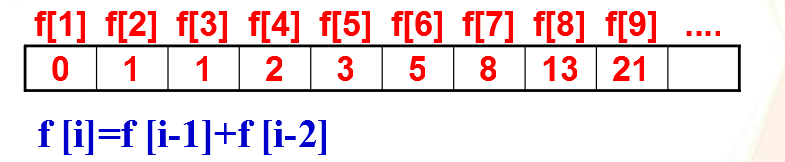

## 题目1:

【描述】编写一个程序。完成从键盘输入n(`n<=1000`)个整数，然后反向输出。

【样例输入】

```
4
1 2 3 4
```

【样例输出】

```
4 3 2 1
```


## 题目2:

【问题描述】 已知faibonacci数列的前几个数分别为0，1，1，2，3，5，……编程求出此数列的第n项。（n由键盘输入）n<=60


【文件输入】

输入数字n（n<=60）

【文件输出】

输出faibonacci数列中的第n个数

【样例输入】

```
5
```

【样例输出】

```
3
```




## 题目3

【问题描述】

对于一个递增数组a，元素个数为n，输入一个数据x，如果x存在于数组a，则把x元素删除；否则将x插在相应的位置，要求数组仍然递增，然后依次输出新的数组元素。

【文件输入】

第一行一个整数n，第二行为依次递增的n个元素，第三行为一个数字x。

【文件输出】

新的数组元素。

【样例输入】

```
5
10 23 34 53 83
34
```

【样例输出】

```
10 23 53 83
```
